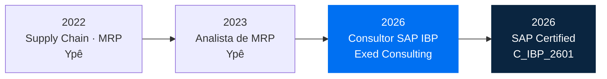
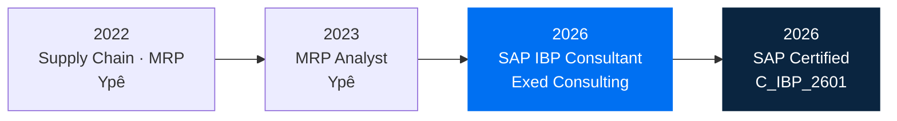

<!-- ============================================================
     GITHUB PROFILE — João Vitor Ferreti Lippi | SAP IBP Consultant
     Remaining placeholders: joaoferreti, LINK_CREDLY, LINK_CV_PT, LINK_CV_EN, SETOR
     ============================================================ -->

  

  

  
  
  

  
  

---

<!-- ████████████████████████  PORTUGUÊS  ████████████████████████ -->

# 🇧🇷 Português

## 👨‍💼 Sobre mim

**Consultor SAP IBP certificado (C_IBP_2601)** na Exed Consulting, com **mais de 3 anos de vivência em planejamento de supply chain na indústria** (MRP e previsão de demanda para S&OP). Uno a visão de quem já esteve do lado do planejador com a capacidade técnica de modelar, integrar e sustentar soluções no SAP IBP, sempre orientado por dados.

📍 Amparo, SP • 🗣️ Português (nativo) · Inglês (avançado) · Alemão (intermediário)

## 🧠 SAP IBP — Domínio Funcional

| Módulo | Escopo |
|---|---|
| **Sales & Operations Planning** | Ciclo mensal de S&OP (produto → demanda → supply → reconciliação → executivo), plano de consenso, versões e cenários *what-if*, comparação de planos, Process Management |
| **Demand Planning** | Forecast estatístico (Exponential Smoothing, Croston/TSB, ARIMA/Auto-ARIMA, MLR, Gradient Boosting), pré-processamento (outliers, missing values), Manage Forecast Models, demand sensing, lifecycle planning, KPIs de acuracidade (MAPE, WMAPE, BIAS, FVA) com snapshots por lag |
| **Supply Planning (time-series)** | Heurística e otimizador, planejamento irrestrito e com restrições de capacidade, sourcing, rough-cut capacity planning, deployment |
| **Inventory Optimization** | Otimização multiestágio, estoque de segurança por nível de serviço, variabilidade de demanda e lead time |
| **Response & Supply (order-based)** | Planejamento baseado em ordens, alocação e product allocation, confirmação de pedidos, gating factor analysis |
| **Visibilidade & Controle** | Supply Chain Control Tower, alertas customizados, dashboards e analytics |

## ⚙️ SAP IBP — Modelagem & Configuração

- **Planning Area**: planning levels, master data types (simple, compound, reference, virtual, external), atributos e attribute transformations
- **Key Figures**: stored, calculated e helper; lógica de cálculo, agregação/desagregação, time profiles e horizontes
- **Operadores & Jobs**: copy, snapshot, desagregação, forecast, supply; application jobs, agendamento e job chains
- **Versões, cenários, change history, regras e alertas**
- **Excel Add-in**: planning views, templates, favoritos, planner-defined key figures, local members
- **Fiori/Web UI**: apps de configuração, Planner Workspaces, analytics, monitoramento de jobs e logs
- **Segurança**: business roles, permission filters e visibility filters

## 🔄 Atuação como Consultor

`Fit-to-Standard` → `Solution Design` → `Build` → `Integração` → `Testes (UT, SIT, UAT)` → `Cutover & Go-live` → `Hypercare` → `AMS`

Workshops com o negócio (SAP Activate) · especificações funcionais · mapeamento e validação de dados · treinamento de key users · análise de causa raiz de chamados · melhoria contínua de KPIs

## 🏢 Ecossistema SAP S/4HANA & ERP

- **Processos integrados**: Plan-to-Produce (PP, MRP, PP/DS), Procure-to-Pay (MM), Order-to-Cash (SD), gestão de estoques
- **Dados mestres logísticos**: material master (visões MRP), centros, BOM, roteiros e centros de trabalho, versões de produção, fontes de suprimento, STO
- **Integração S/4HANA ↔ IBP**: fluxos time-series e order-based (Real-Time Integration)
- **Plataforma**: SAP ECC e S/4HANA, SAP BTP, SAP Cloud Integration, SAP Analytics Cloud

## 🔌 SAP CI-DS

Conhecimento prático no contexto de integração com o IBP: projetos, tasks e data flows; execução, agendamento e monitoramento de cargas; análise de logs e ajustes pontuais de mapeamentos e filtros.

## 📊 Dados aplicados ao Planejamento

- **Python** (Pandas, NumPy, Matplotlib, Seaborn, Jupyter), **R** e **SQL** para tratamento de grandes volumes, estatística e modelos preditivos
- **Power BI** (DAX, dashboards dinâmicos) e **Excel avançado**
- **Lean Six Sigma Green Belt**: melhoria contínua orientada por dados
- Noções de desenvolvimento SAP no BTP (Data Dictionary, telas de seleção, debugging)

## 💼 Experiência

### Consultor SAP IBP — Exed Consulting
`01/2026 – atual`
- Projeto SAP IBP no setor de SETOR, com foco em Demand Planning e S&OP
- Reconfiguração do cálculo de acuracidade (WMAPE/BIAS), alterando a agregação de centro para segmento × mercado para alinhar o KPI à visão de gestão do cliente
- Diagnóstico de consistência e qualidade de dados mestres da Planning Area

### Analista de MRP — Ypê
`03/2023 – 12/2025` · Amparo, SP
- Previsão de demanda para o ciclo de S&OP com modelos estatísticos e técnicas preditivas, elevando a assertividade do planejamento
- Otimização contínua dos processos de MRP por meio de análise quantitativa, automação e identificação de padrões
- Processamento de grandes volumes de dados de planejamento com Python, R e SQL
- Relatórios de desempenho do MRP, convertendo análises complexas em insights acionáveis para stakeholders

### Supply Chain · MRP — Ypê
`09/2022 – 03/2023` · Amparo, SP
- Início da trajetória em planejamento de materiais (MRP) na cadeia de suprimentos

## 🏅 Certificações & Cursos

| Certificação | Emissor | Status |
|---|---|---|
| **SAP Certified – SAP Integrated Business Planning** (C_IBP_2601) | SAP | ✅ 09/2026 • [Credencial](LINK_CREDLY) |
| **Positioning SAP Business AI Platform** (C_BCBTP) | SAP | 📚 Em preparação |
| **Lean Six Sigma – Green Belt** | FM2S | ✅ |
| **Power BI – Avançado** | Udemy | ✅ |

**Cursos:** Learning to Program Fiori Applications on SAP BTP · Python – Análise de Dados · Power BI Completo · DevOps Tour e Java Week (IFSP)

## 🎓 Formação

**Tecnologia em Análise e Desenvolvimento de Sistemas** — Instituto Federal de São Paulo (IFSP), Bragança Paulista · `2022 – 2026`

## 🤝 Liderança

**Membro eleito do Conselho e do Colegiado do IFSP** · `10/2025 – atual`
Representação estudantil e deliberação de pautas acadêmicas, administrativas e estratégicas da instituição.

## 📫 Contato

<a href="#en">🇺🇸 English version ↓</a>

---

<!-- ████████████████████████  ENGLISH  ████████████████████████ -->

# 🇺🇸 English

## 👨‍💼 About me

**SAP Certified IBP Consultant (C_IBP_2601)** at Exed Consulting, with **3+ years of hands-on supply chain planning experience in manufacturing** (MRP and demand forecasting for S&OP). I bring the perspective of someone who has sat in the planner's seat, combined with the technical ability to model, integrate and support SAP IBP solutions, always data-driven.

📍 Amparo, Brazil • 🗣️ Portuguese (native) · English (advanced) · German (intermediate)

## 🧠 SAP IBP — Functional Expertise

| Module | Scope |
|---|---|
| **Sales & Operations Planning** | Monthly S&OP cycle (product → demand → supply → reconciliation → executive), consensus planning, versions and what-if scenarios, plan comparison, Process Management |
| **Demand Planning** | Statistical forecasting (Exponential Smoothing, Croston/TSB, ARIMA/Auto-ARIMA, MLR, Gradient Boosting), pre-processing (outliers, missing values), Manage Forecast Models, demand sensing, lifecycle planning, forecast accuracy KPIs (MAPE, WMAPE, BIAS, FVA) with lag-based snapshots |
| **Supply Planning (time-series)** | Heuristic and optimizer, unconstrained and capacity-constrained planning, sourcing, rough-cut capacity planning, deployment |
| **Inventory Optimization** | Multi-stage optimization, service-level-driven safety stock, demand and lead-time variability |
| **Response & Supply (order-based)** | Order-based planning, allocation and product allocation, order confirmation, gating factor analysis |
| **Visibility & Control** | Supply Chain Control Tower, custom alerts, dashboards and analytics |

## ⚙️ SAP IBP — Modeling & Configuration

- **Planning Area**: planning levels, master data types (simple, compound, reference, virtual, external), attributes and attribute transformations
- **Key Figures**: stored, calculated and helper; calculation logic, aggregation/disaggregation, time profiles and horizons
- **Operators & Jobs**: copy, snapshot, disaggregation, forecast, supply; application jobs, scheduling and job chains
- **Versions, scenarios, change history, rules and alerts**
- **Excel Add-in**: planning views, templates, favorites, planner-defined key figures, local members
- **Fiori/Web UI**: configuration apps, Planner Workspaces, analytics, job and log monitoring
- **Security**: business roles, permission filters and visibility filters

## 🔄 Consulting Delivery

`Fit-to-Standard` → `Solution Design` → `Build` → `Integration` → `Testing (UT, SIT, UAT)` → `Cutover & Go-live` → `Hypercare` → `AMS`

Business workshops (SAP Activate) · functional specifications · data mapping and validation · key user training · incident root cause analysis · continuous KPI improvement

## 🏢 SAP S/4HANA & ERP Ecosystem

- **Integrated processes**: Plan-to-Produce (PP, MRP, PP/DS), Procure-to-Pay (MM), Order-to-Cash (SD), inventory management
- **Logistics master data**: material master (MRP views), plants, BOMs, routings and work centers, production versions, sources of supply, STO
- **S/4HANA ↔ IBP integration**: time-series and order-based flows (Real-Time Integration)
- **Platform**: SAP ECC and S/4HANA, SAP BTP, SAP Cloud Integration, SAP Analytics Cloud

## 🔌 SAP CI-DS

Hands-on knowledge in the context of IBP integration: projects, tasks and data flows; running, scheduling and monitoring loads; log analysis and targeted mapping and filter adjustments.

## 📊 Data-Driven Planning

- **Python** (Pandas, NumPy, Matplotlib, Seaborn, Jupyter), **R** and **SQL** for large-volume data processing, statistics and predictive models
- **Power BI** (DAX, dynamic dashboards) and **advanced Excel**
- **Lean Six Sigma Green Belt**: data-driven continuous improvement
- Foundations of SAP development on BTP (Data Dictionary, selection screens, debugging)

## 💼 Experience

### SAP IBP Consultant — Exed Consulting
`01/2026 – present`
- SAP IBP project in the SETOR industry, focused on Demand Planning and S&OP
- Reconfigured forecast accuracy calculation (WMAPE/BIAS), moving aggregation from plant to segment × market to align the KPI with the client's management view
- Consistency and quality diagnosis of Planning Area master data

### MRP Analyst — Ypê
`03/2023 – 12/2025` · Amparo, Brazil
- Demand forecasting for the S&OP cycle using statistical models and predictive techniques, improving planning accuracy
- Continuous MRP process optimization through quantitative analysis, automation and pattern detection
- Large-volume planning data processing with Python, R and SQL
- MRP performance reporting, turning complex analyses into actionable insights for stakeholders

### Supply Chain · MRP — Ypê
`09/2022 – 03/2023` · Amparo, Brazil
- Started my career in material requirements planning (MRP) within supply chain

## 🏅 Certifications & Courses

| Certification | Issuer | Status |
|---|---|---|
| **SAP Certified – SAP Integrated Business Planning** (C_IBP_2601) | SAP | ✅ 09/2026 • [Credential](LINK_CREDLY) |
| **Positioning SAP Business AI Platform** (C_BCBTP) | SAP | 📚 In preparation |
| **Lean Six Sigma – Green Belt** | FM2S | ✅ |
| **Power BI – Advanced** | Udemy | ✅ |

**Courses:** Learning to Program Fiori Applications on SAP BTP · Python for Data Analysis · Power BI Complete · DevOps Tour and Java Week (IFSP)

## 🎓 Education

**Technology Degree in Systems Analysis and Development** — Federal Institute of São Paulo (IFSP), Bragança Paulista · `2022 – 2026`

## 🤝 Leadership

**Elected Member of the IFSP Council and Collegiate Board** · `10/2025 – present`
Student representation and deliberation on the institution's academic, administrative and strategic matters.

## 📫 Contact

<a href="#pt">🇧🇷 Versão em português ↑</a>

---

<!-- ████████████████████████  STACK & STATS  ████████████████████████ -->

  
  
  
  
  
   
  
  
  
  

  
  

  <i>“A dúvida é o princípio da sabedoria.” · “Doubt is the beginning of wisdom.” — Aristóteles</i>

  

